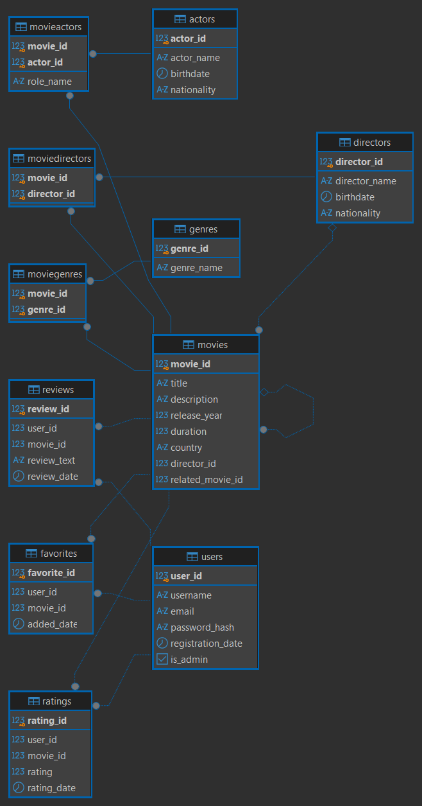

# Cinema DB - SQL Queries

SQL-проект по работе с реляционной базой данных «Kinopoisk» в PostgreSQL. Демонстрирует навыки написания запросов: от базовой выборки до подзапросов, транзакций и анализа плана выполнения.

Все SQL-скрипты доступны в папке [`queries/`](./sql/).

---

## О проекте

Проект представляет собой набор SQL-запросов к базе данных, имитирующей сервис по фильмам. База включает таблицы фильмов, актёров, режиссёров, жанров, пользователей, оценок, рецензий и избранного. Запросы демонстрируют работу с выборкой, фильтрацией, сортировкой, агрегацией, подзапросами, транзакциями и оптимизацией.

---

## Структура базы данных

База состоит из 11 таблиц, связанных между собой:

- `movies` - фильмы: название, год выпуска, продолжительность, страна, режиссёр.
- `users` - пользователи: имя, email, дата регистрации, признак администратора.
- `directors` - режиссёры: имя, дата рождения, национальность.
- `actors` - актёры: имя, дата рождения, национальность.
- `genres` - жанры: название.
- `movieactors` - связь фильмов и актёров (роль).
- `moviedirectors` - связь фильмов и режиссёров.
- `moviegenres` - связь фильмов и жанров.
- `reviews` - рецензии: пользователь, фильм, текст, дата.
- `favorites` - избранное: пользователь, фильм, дата добавления.
- `ratings` - оценки: пользователь, фильм, оценка, дата.

**Связи:** фильмы связаны с режиссёрами, актёрами и жанрами через промежуточные таблицы. Пользователи связаны с фильмами через оценки, рецензии и избранное.

**Схема базы данных**

---

## Содержание

### 01. SELECT'ы и фильтрация
**Файл:** `sql/01_selects_and_filtering.sql`

Базовые запросы на выборку данных. Включены:

- выборка всех фильмов, пользователей, режиссёров;
- фильтрация по году выпуска, стране, продолжительности, национальности;
- сортировка по одному и нескольким полям (по году, стране, названию);
- ограничение количества строк с помощью LIMIT и OFFSET;
- фильтрация по диапазону (BETWEEN), по списку (IN), по шаблону (LIKE);
- работа с логическими операторами AND, OR, NOT;
- приведение типов для сравнения дат и чисел.

### 02. Подзапросы и агрегации
**Файл:** `sql/02_subqueries_and_aggregations.sql`

Запросы с подзапросами и агрегатными функциями. Включены:

- поиск фильмов с максимальной продолжительностью;
- поиск пользователей, поставивших хотя бы одну оценку;
- поиск фильмов без рецензий;
- поиск режиссёров, снявших фильмы после 2010 года;
- группировка по странам с фильтрацией через HAVING (средняя продолжительность выше средней по базе);
- поиск фильмов, добавленных в избранное чаще других;
- поиск пользователей, поставивших оценку выше средней;
- поиск фильмов, относящихся к нескольким жанрам;
- поиск пользователей, добавивших в избранное более трёх фильмов;
- поиск актёров, снимавшихся у Кристофера Нолана.

### 03. Транзакции
**Файл:** `sql/03_transactions.sql`

Работа с транзакциями для обеспечения целостности данных. Включены:

- добавление пользователя и его первой оценки;
- обновление страны производства фильма и удаление связанных жанров;
- добавление фильма в избранное с проверкой существования пользователя и фильма;
- добавление двух пользователей и их рецензий;
- удаление фильма и всех связанных записей (жанры, оценки, избранное, рецензии).

Во всех случаях используются BEGIN, COMMIT и ROLLBACK для отката изменений при ошибке.

### 04. EXPLAIN и оптимизация
**Файл:** `sql/04_explain_and_optimization.sql`

Анализ плана выполнения запросов с помощью EXPLAIN и EXPLAIN ANALYZE. Включены:

- план выполнения простого запроса с фильтрацией по году;
- план выполнения запроса с подзапросом;
- план выполнения запроса с двумя подзапросами и фильтрацией;
- анализ реального времени выполнения запроса с JOIN и фильтрацией.

### 05. Операции над множествами
**Файл:** `sql/05_set_operations.sql`

Запросы с операциями UNION, UNION ALL, INTERSECT и EXCEPT. Включены:

- объединение имён покупателей и названий товаров с сохранением дубликатов;
- пересечение покупателей, заказавших товары из двух разных наборов;
- исключение товаров категории «Электроника» из списка;
- объединение товаров двух категорий;
- объединение заказов с большим количеством и товаров с высокой ценой;
- пересечение товаров, заказанных несколькими покупателями;
- исключение товаров категории «Канцелярия»;
- объединение заказов за декабрь 2023 и товаров дороже 2010;
- пересечение товаров, заказанных тремя покупателями.

---

## Структура проекта

- `cinema-db/`
  - `README.md`
  - `schema.sql` - информация о таблицах
  - `kinopoisk_er_diagram.png` - схема связей таблиц
  - `queries/`
    - `01_selects_and_filtering.sql`
    - `02_subqueries_and_aggregations.sql`
    - `03_transactions.sql`
    - `04_explain_and_optimization.sql`
    - `05_set_operations.sql`
